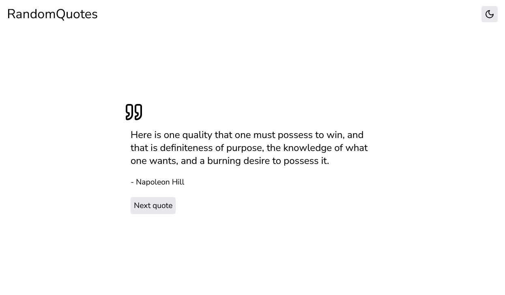
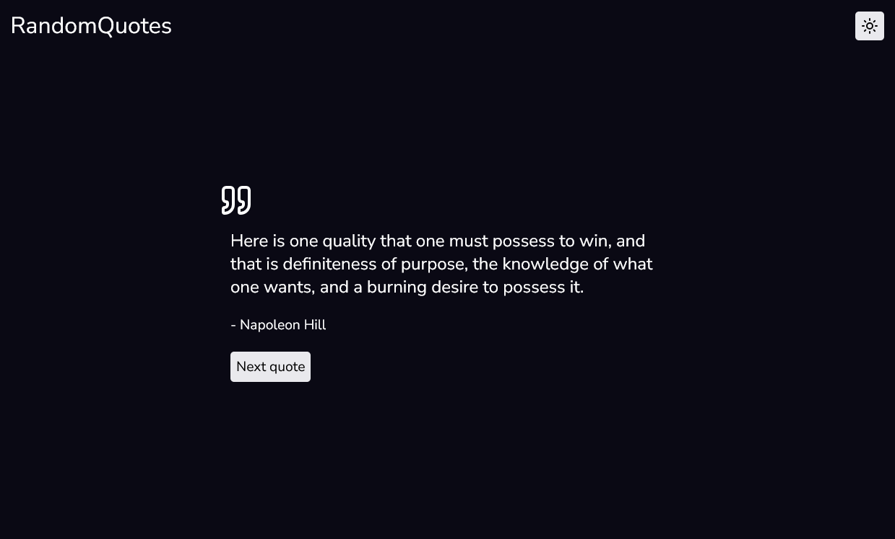

---

# 📝 Minimalistic Quote Web App

A simple and clean web app that displays a new inspirational quote every time the user clicks a button. Supports both dark and light themes.

Powered by the [Quotable API](https://api.quotable.io).

## ✨ Features

- 🔁 Get a new quote on button click
- 🌗 Toggle between dark and light theme
- ⚡️ Lightweight and fast

## 🖼️ Preview

  

## 🛠️ Tech Stack

- HTML
- CSS
- JavaScript
- [Quotable API](https://api.quotable.io)
  
## ⚙️ How It Works

- On page load and every button click, the app fetches a random quote from the [Quotable API](https://api.quotable.io/random).
- Theme switching is handled via a toggle using localStorage.

## 🧑‍💻 Author

- [Delta](https://github.com/delta6626)

## 📃 License

This project is licensed under the MIT License.

---
