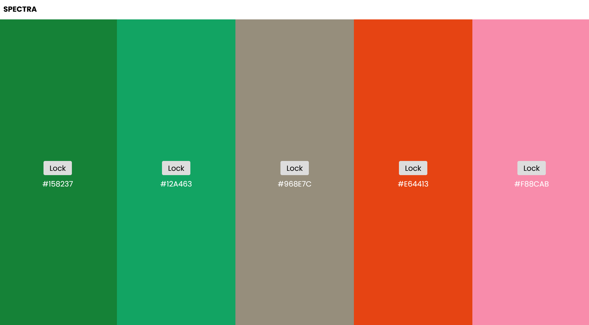

---

# 🎨 Spectra – A Minimalist Color Palette Generator

Spectra is a super simple and clean mini clone of [coolors.co](https://coolors.co). 
Press the spacebar to generate new colors and click on any color to lock it. Designed for fast, intuitive use and minimal distraction.
Written in pure HTML, CSS and JavaScript. No fancy frameworks.

---

## 🚀 Features

- Instant color generation  
- Lock/unlock individual colors  

---

## 📸 Screenshots

---

## 🛠️ Tech Stack

- HTML  
- CSS  
- JavaScript  

---

## 📦 How to Use

1. Clone or download the project  
2. Open `index.html` in your browser  
3. Press space to start generating palettes  
4. Click on any color to lock it  

No installations or dependencies needed.

---

## 📁 Folder Structure

- index.html  
- style.css  
- script.js  
- assets/  
  - spectra.png

---

## 📄 License

MIT License. Free to use and modify.

---
