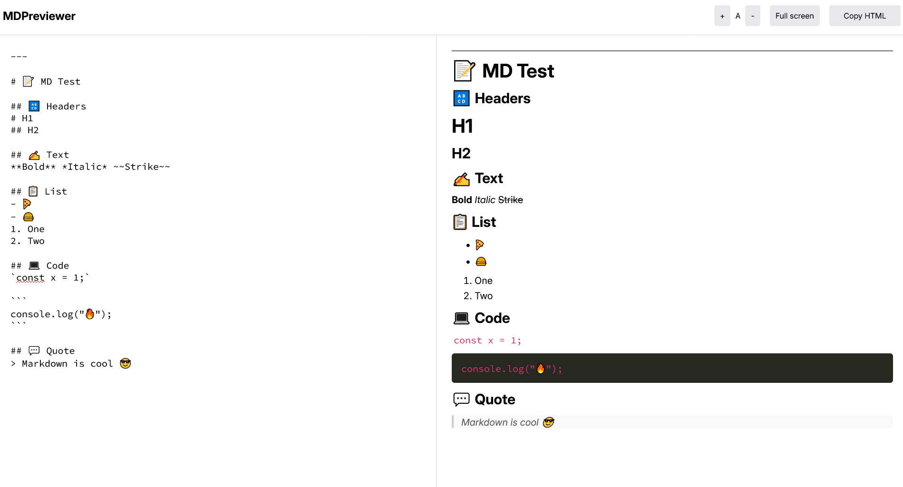

---

# 📝 Markdown Previewer

A lightweight, no-framework Markdown previewer built using pure **HTML**, **CSS**, and **JavaScript**. It utilizes the [Marked](https://github.com/markedjs/marked) library for parsing Markdown and instantly previews the rendered HTML.

---

## 🚀 Features

- 🔥 Live preview as you type
- 🧼 Clean, minimal UI
- 🛠 Built with vanilla HTML, CSS, and JS — no frameworks
- 🧩 Uses [Marked.js](https://github.com/markedjs/marked) for fast and compliant Markdown parsing

---

## 📸 Screenshot



---

## 📦 Installation & Usage

1. Clone or download this repository:

   ```bash
   git clone https://github.com/delta6626/365-days-of-code.git
   cd 365-days-of-code/day3/markdown-previewer
   ```

2. Open the `index.html` file in your browser:

   ```bash
   open index.html
   ```

> ✅ No build steps. No dependencies besides Marked (via CDN). Just open and go.

---

## 🛠 Tech Stack

- **HTML5** for structure
- **CSS3** for styling
- **JavaScript (ES6)** for interactivity
- **[Marked.js](https://marked.js.org/)** for Markdown parsing

---

## 🧪 Example Markdown

Type this in the editor:

   ```markdown
   # Hello World

   This is **bold**, _italic_, and [a link](https://example.com).

   - Item 1
   - Item 2

   > Blockquote

   `inline code`

   ```
And see the preview on the right update in real time. ✨

---

## 🙌 Acknowledgements

- [Marked](https://github.com/markedjs/marked) for the awesome Markdown parser

---

## 📄 License

This project is open-source under the MIT License.

---
