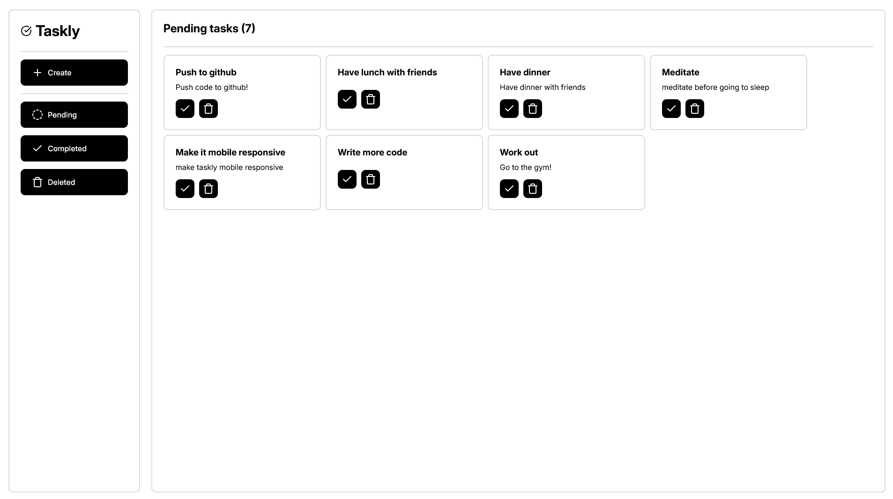

---

# 📝 Simple Task Manager

A lightweight, no-framework task manager built with HTML, CSS, and JavaScript. Tasks are stored in LocalStorage, so everything stays on your device—no backend, no signups, just fast and simple task tracking.

## 🚀 Features

- Add tasks  
- Mark tasks as completed or pending  
- Soft delete (moves tasks to Recycle Bin)  
- Permanently delete tasks from Recycle Bin  
- LocalStorage-based (your data stays in your browser)  
- Clean UI using [Lucide Icons](https://lucide.dev/)

## 📂 File Structure

- `index.html` – Main HTML file  
- `styles.css` – All styles for the app  
- `script.js` – JavaScript for logic and interactions  
- `assets/` – (Optional) Folder for screenshots or icons

## 📷 Screenshot

## 🛠️ How to Use

1. Clone the repo or download the ZIP.  
2. Open `index.html` in any browser.  
3. Start managing your tasks!

*Note: Since it's fully static, you can also host it on GitHub Pages, Netlify, or Vercel easily.*

## 🧾 License

This project is licensed under the MIT License.

---
